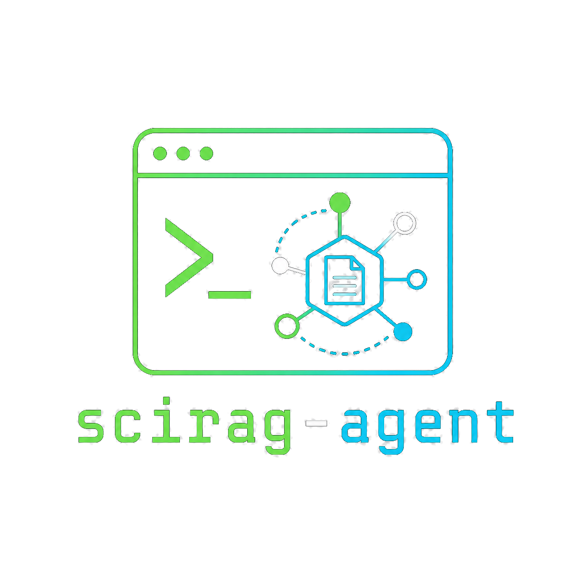

# scirag-agent
<p align="center">
  
</p>

An interactive shell for building a **local, curated literature index** and asking
grounded, cited questions against it. Sources: PubMed, bioRxiv, local PDFs, or any
free-form text. LLM-agnostic — runs fully offline via Ollama or routes to frontier
models (Claude / OpenAI) through a single config switch.

---


---

## Why scirag?

Two common workflows for LLM-assisted literature review — and where they fall short:

| | LLM + PubMed MCP / direct API | Cloud project mode (upload PDFs) | **scirag** |
|---|---|---|---|
| **Answer grounding** | None — LLM synthesises freely from returned text | Opaque — no guarantee claims map to specific passages | Every claim cited with `[PMID]` / `[DOI]` |
| **Text depth** | Abstract only (what the paper claimed to study) | Whatever the upload pipeline extracts | Prioritises **Results section** (what the paper actually found) |
| **RAG transparency** | None | Black box — chunks and scores hidden | Full — `/retrieve` shows ranked chunks, `/show` shows stored text |
| **Index curation** | Model retrieves from all of PubMed on every query | Fixed to whatever files you uploaded | You select exactly which papers are in scope, organised by project |
| **Privacy** | Queries sent to NCBI + LLM provider | Papers uploaded to cloud storage | Index stays on your machine; Ollama option is fully offline |
| **Hallucination risk** | High — no grounding enforcement | Medium — grounding is implicit | Low — model is given only the retrieved passages; falls back to general knowledge explicitly when no source clears the relevance threshold |

The core trade-off scirag makes: you spend a little time curating an index, and in return every answer is verifiable and every retrieved passage is inspectable.

---

## What goes into the index

- **PubMed articles** — fetched by keyword search and indexed with full-text when
  available (Results section via PMC, or open-access PDF via Unpaywall).
- **bioRxiv preprints** — searched via Europe PMC and indexed with full JATS XML
  when available.
- **Local PDFs** — resolved to a PubMed record by PMID, DOI, or title search.
- **Free-form text** — paste any text directly with `/import-text` (prompted for title,
  identifier, origin, year, author).

Built with **LlamaIndex** (chunking, embeddings, LanceDB vector store, hybrid
dense + BM25 retrieval with optional cross-encoder reranking) and **LiteLLM**
(one router across local and frontier LLMs).

---

## Install

**Just use it** — installs the `scirag` command into an isolated environment, no
checkout needed. Most users just want the web UI:

```
uv tool install "scirag-agent[ui] @ git+https://github.com/ytsimon2004/scirag-agent"
```

The bare install (`uv tool install git+https://github.com/ytsimon2004/scirag-agent`)
gives the CLI + interactive shell with no extras. Everything else is optional — add
any extra comma-separated, e.g. `scirag-agent[ui,rerank]`. The only heavy one is
`rerank` (sentence-transformers + torch, pinned to the **CPU** build so ~1 GB, not
the ~6 GB CUDA stack — the reranker just re-scores candidates; all real inference
runs through Ollama). See [Optional extras](#optional-extras).

> Once scirag is published to PyPI, this becomes a plain `uv tool install
> "scirag-agent[ui]"` (or `pip install "scirag-agent[ui]"`) — no git URL needed.

**Develop on it** — editable checkout with dev tooling (ruff/pre-commit/pytest):

```
git clone https://github.com/ytsimon2004/scirag-agent && cd scirag-agent
uv sync --extra all
```

**Embeddings (always required) — Ollama.** Indexing and retrieval use a local
embedding model, so Ollama must be running with `bge-m3` whichever LLM you choose:

```
ollama serve
ollama pull bge-m3                         # embeddings (~1.2 GB)
```

**LLM — pick one:**

- **Local (default), via Ollama** — no API key:
  ```
  ollama pull qwen3:14b-q4_K_M             # ~9 GB
  ```
- **`claude-code` / `codex`** — reuse your existing Claude Code or OpenAI Codex
  CLI login (no API key, no model download); select with `/model claude-code`.
- **Frontier API** — Claude / OpenAI via `ANTHROPIC_API_KEY` / `OPENAI_API_KEY`
  (see [API keys](#api-keys-only-for-frontier-backends)).

So the qwen download is optional — only needed if you want a local LLM.

### Optional extras

Pick whichever you need (tool install: `"scirag-agent[ui,rerank] @ git+…"`; dev
checkout: `uv sync --extra ui --extra rerank`). The `[all]` extra is a shorthand for
the light ones (`ui`, `mcp`, `eval`) — `rerank` is deliberately left out of it:

| Extra | Enables |
|---|---|
| `ui` | Chainlit web UI (`/ui`) |
| `rerank` | Cross-encoder reranking (`bge-reranker-v2-m3`); then `/rag rerank on`. Pulls torch |
| `mcp` | MCP server exposing retrieval as tools |
| `eval` | RAG evaluation (ragas) |

---

## Getting started

Run `scirag` with no arguments to open the interactive shell. A first session
usually goes: **create a project → pick a model → index → ask**.

### 1 — Create a project

Projects keep a separate index per topic (stored under `~/.scirag-agent/projects/`).
Working without one uses a shared global index.

```
scirag ❯ /create-project rsc "Retrosplenial cortex circuits"
```

The prompt now shows the active project: `scirag[rsc] ❯`.

```
scirag[rsc] ❯ /project              # list projects
scirag[rsc] ❯ /project place-cells  # switch
scirag[rsc] ❯ /project --default    # back to the global index
scirag[rsc] ❯ /delete-project rsc   # delete (asks to confirm)
```

### 2 — Choose a model

The default is local **Qwen3-14B** via Ollama — no API key needed.

```
scirag[rsc] ❯ /model                 # list backends, mark the active one
scirag[rsc] ❯ /model claude-sonnet   # switch (or use arrow keys with bare /model)
```

| Key | Model | Needs |
|---|---|---|
| `local-qwen3-14b` | `ollama/qwen3:14b-q4_K_M` | — (default) |
| `local-llama4-scout` | `ollama/llama4:17b-scout-16e-instruct-q4_K_M` | — |
| `local-deepseek-r1-32b` | `ollama/deepseek-r1:32b-qwen-distill-q4_K_M` | — |
| `claude-sonnet` / `claude-opus` | `anthropic/claude-sonnet-4-6` / `-opus-4-8` | `ANTHROPIC_API_KEY` |
| `openai-gpt4o` / `openai-o3` | `openai/gpt-4o` / `openai/o3` | `OPENAI_API_KEY` |
| `claude-code` / `codex` | local `claude -p` / `codex` CLI subprocess | that CLI installed + signed in |

Switching in the shell applies to the current session only — `configs/models.yaml`
is never modified. To set a persistent default backend, use `scirag model <key>` from
the CLI (saved to `~/.scirag-agent/settings.yaml`).

### API keys (only for frontier backends)

```
scirag[rsc] ❯ /env set NCBI_API_KEY      <key>   # raises PubMed rate limit to 10 req/s
scirag[rsc] ❯ /env set ANTHROPIC_API_KEY <key>   # claude-* backends
scirag[rsc] ❯ /env set OPENAI_API_KEY    <key>   # openai-* backends
```

Keys are stored in `~/.scirag-agent/.env` — never in the repo.

---

## Core workflow

**index → status → show → ask.**

### 1 — Index papers

**PubMed:**
```
scirag[rsc] ❯ /index "anterior posterior retrosplenial cortex" --retmax 10 --full-text
```

Fetches matching PubMed articles, shows a checkbox list with availability badges
and clickable URLs, then embeds the papers you select. With `--full-text` each
selected paper is enriched to its deepest available text:

- **research articles** → the **Results section** (PMC, else an open-access PDF),
- **review articles** → the **whole body** (reviews have no Results section),
- otherwise → the **abstract**.

**bioRxiv preprints:**
```
scirag[rsc] ❯ /bindex "place cells remapping" --days-back 90 --full-text
```

Searches bioRxiv via Europe PMC (no keyword API on bioRxiv itself), shows the same
checkbox flow, and fetches full JATS XML when available.

**Free-form text:**
```
scirag[rsc] ❯ /import-text
```

Prompts for title, identifier, origin, year, and author(s), then opens `$EDITOR`
for the body. Useful for notes, book chapters, or anything not in PubMed/bioRxiv.

### 2 — Check what's stored

```
scirag[rsc] ❯ /status
```

```
 PMID      Year  First author  Source    Title
 32147692  2020  Powell A      results   Stable Encoding of Visual Cues in the Mouse Retrosplenial Cortex.
 36460006  2023  Alexander AS  review    Rethinking retrosplenial cortex: Perspectives and predictions.
 9270578   1997  Takahashi N   abstract  Pure topographic disorientation due to right retrosplenial lesion.
```

The **Source** column shows the depth each paper was stored at
(`results` / `review` / `abstract`).

### 3 — Inspect a paper

```
scirag[rsc] ❯ /show 32147692
```

Prints the exact embedded text (abstract, Results section, or review body) for
one PMID — the way to confirm what actually went into the index.

### 4 — Ask, grounded in your papers

Just type a question at the prompt — anything not starting with `/` is sent to
the RAG pipeline (a one-line source summary, then a cited answer). History is
kept across turns, so follow-ups work; `/clear` resets the conversation:

```
scirag[rsc] ❯ What distinguishes anterior from posterior RSC?
scirag[rsc] ❯ Which cell types mediate this?     # follow-up, in context
scirag[rsc] ❯ /clear                             # reset the conversation
```

When no indexed source is relevant enough, scirag answers from general
knowledge and says so instead of citing weak matches.

---

## Supporting commands

### Tune reasoning & retrieval

**Reasoning effort** — trade speed for depth. `low` turns the local model's
thinking off (fastest); `medium`/`high` keep it on. Maps per backend (Ollama
`think`, frontier `reasoning_effort`, `claude --effort`, `codex` reasoning):

```
scirag[rsc] ❯ /effort           # show current (default: medium)
scirag[rsc] ❯ /effort low       # fastest answers
```

Each answer prints its effort and elapsed time, so you can compare.

**Retrieval parameters** — control which chunks reach the LLM. `/rag` opens a
picker (with per-parameter help explaining the effect), or set one directly:

```
scirag[rsc] ❯ /rag                  # interactive picker
scirag[rsc] ❯ /rag final_k 12       # send more chunks (better recall, larger prompt)
scirag[rsc] ❯ /rag rerank on        # cross-encoder rerank (needs --extra rerank)
```

| Param | Effect |
|---|---|
| `final_k` | Chunks sent to the LLM. Biggest lever on recall **and** latency |
| `top_k` / `bm25_k` | Candidate pool size (dense / keyword). Cheap — doesn't grow the prompt |
| `hybrid` | Dense + BM25 fusion (on) vs. dense-only (off) |
| `rerank` | Re-score candidates with a cross-encoder, keep the best `final_k` |
| `rag_score_threshold` | Min similarity to answer from your papers vs. general knowledge |

In the shell, `/model`, `/effort`, and `/rag` are **session-only** (reset each
launch); `/status` shows the active values. To set a **persistent default** instead,
use the CLI — `scirag model claude-sonnet`, `scirag effort high`, `scirag rag final_k 12`
— which writes to `~/.scirag-agent/settings.yaml` and is read at every launch. The
resolution order is: shell session override → `settings.yaml` default → shipped
YAML config.

### Import PDFs

When automatic full-text retrieval can't reach a paper, import PDFs you've
downloaded:

```
scirag[rsc] ❯ /import ~/Downloads/paper.pdf          # single PDF
scirag[rsc] ❯ /import ~/Downloads/papers/            # all PDFs in a folder
```

`/import` routes automatically — pass a file or a directory. Each PDF is resolved
to a PubMed record by **PMID** (numeric filename), **DOI**, or **title search**.
Unresolved PDFs are *not* imported — scirag prints a PubMed lookup URL; find the
PMID, rename the file to `<PMID>.pdf`, and re-import. Path arguments tab-complete,
and `→` descends into a directory.

### Import from Mendeley

Pull papers straight from your local **Mendeley Reference Manager** library —
fully offline, no OAuth:

```
scirag[rsc] ❯ /import-mendeley "place cells"            # search title/authors/abstract
scirag[rsc] ❯ /import-mendeley "grid cells" --retmax 40
```

scirag reads Mendeley's local database (and the PDF text it already extracted),
shows the matches in a checkbox list to select, and indexes them — isolating each
paper's Results section just like `/index`, and falling back to the whole body
(references stripped) when Mendeley's text has no clean Results heading, so you get
the paper's content rather than just the abstract. Imports are keyed by **PMID** (else a
bioRxiv DOI, else a `mendeley-<id>` fallback), so a paper you also fetched via
`/index`/`/bindex` is recognised as already indexed instead of duplicated. The
install location is auto-detected per OS (macOS/Windows/Linux); for a non-default
or portable install, set `sources.mendeley.db_path` (and optionally
`userfiles_path`) in `pipeline.yaml`, or `/env set MENDELEY_DB_PATH <path-to-.db>`
(the env var wins).

### Web UI

```
scirag[rsc] ❯ /ui              # opens http://localhost:8000
scirag[rsc] ❯ /ui --port 8080  # custom port
```

Requires `uv sync --extra ui`. Streaming chat, a **click-to-expand Sources** row
per answer, and a ⚙️ settings panel to adjust **backend, reasoning effort, and
retrieval params** (`final_k`, `top_k`, `bm25_k`, `hybrid`, `rerank`, threshold)
mid-conversation. The web UI and shell share the same index and project — index in
the shell, ask in the browser, or mix freely.

---

## All shell commands

Type any text that **doesn't** start with `/` to ask a grounded question (RAG
answer with conversation history). Commands all start with `/`:

| Command | Description |
|---|---|
| `/index <query> [--retmax N] [--full-text] [--semantic] [--year-from YYYY] [--year-to YYYY]` | Fetch, select, and embed PubMed articles |
| `/bindex <query> [--retmax N] [--days-back N] [--full-text] [--year-from YYYY] [--year-to YYYY]` | Fetch, select, and embed bioRxiv preprints |
| `/import-text` | Index free-form text (prompts for metadata + opens editor) |
| `/retrieve <query>` | Show retrieved chunks for a query (no LLM) |
| `/show <pmid>` | Print a paper's stored abstract/results/review text |
| `/ui [--port N]` | Open the Chainlit web UI |
| `/model [backend-key]` | List or switch LLM backend |
| `/effort [low\|medium\|high]` | Set LLM reasoning effort (speed vs. accuracy) |
| `/rag [<param> <value>]` | Tune retrieval params (final_k, top_k, rerank, …); no args = picker |
| `/import <path>` | Import a PDF file or directory of PDFs, resolved to PubMed |
| `/import-mendeley <query> [--retmax N]` | Search the local Mendeley library, select, and index papers |
| `/import-zotero <query> [--retmax N]` | Search the local Zotero library, select, and index papers |
| `/env [set\|unset <KEY> <val>]` | Manage API keys in `~/.scirag-agent/.env` |
| `/status` | Index listing + statistics |
| `/export [path]` | Export indexed papers' metadata to CSV |
| `/remove [pmid …]` | Remove article(s) from the index |
| `/clear-db [--force]` | Delete the active index |
| `/create-project <name> [desc]` / `/project [name\|--default]` / `/delete-project <name>` | Manage projects |
| `/help` · `/clear` · `/exit` | Help, reset conversation, quit |

### CLI (outside the shell)

The shell is the main interface; the CLI is a small surface for the things you do
**without** entering it — launching, configuring, and scripting:

| Command | Description |
|---|---|
| `scirag` | Open the interactive shell (no args) |
| `scirag ui [--port N]` | Launch the Chainlit web UI |
| `scirag ask "<question>"` | One-shot grounded answer (scriptable, pipeable) |
| `scirag export [path]` | Export indexed metadata to CSV |
| `scirag env [set\|unset <KEY> <val>]` | Manage API keys in `~/.scirag-agent/.env` |
| `scirag model [key]` / `effort [low\|med\|high]` / `rag [<param> <value>]` | Set **persistent defaults** in `~/.scirag-agent/settings.yaml` |

Everything else (indexing, retrieval, import, project & index management) is
interactive and lives only in the shell. Note `model`/`effort`/`rag` differ by
surface: the **CLI** sets a saved default; the **shell** `/model`,`/effort`,`/rag`
are session-only overrides on top of it.

**Which project?** `ask`, `export`, and `ui` use the **active project** (whatever the
shell's `/project` last selected, stored in `~/.scirag-agent/.active_project`) — it's
shared state across the shell and CLI. To target a different one for a single run
without changing the active project, pass `--project <name>` or `--global` (these set
`SCIRAG_PROJECT` for that invocation only):

```
scirag ask "place cell remapping?" --project rsc
scirag export --global out.csv
```

---

## Data layout

```
~/.scirag-agent/
  .env                        # API keys (managed by /env)
  lancedb/                    # global index
  projects/
    rsc/lancedb/              # per-project indexes
  projects.json               # project registry
  .active_project             # active project name

configs/
  models.yaml                 # LLM backends + embeddings (per-agent routing)
  pipeline.yaml               # chunk sizes, retrieval parameters
```

---

## Full-text coverage

| Source | Used for | Requires |
|---|---|---|
| PMC full text (Results section) | PubMed research articles | open-access in PMC |
| bioRxiv JATS XML (Results section) | bioRxiv preprints | `--full-text` with `/bindex` |
| Review whole-body | PubMed review articles | resolved as a PubMed `Review` |
| Manual PDF import | anything resolvable to a PMID/DOI | `/import <path>` |
| Mendeley library (Results section, else whole body) | papers in your Mendeley Reference Manager | `/import-mendeley <query>` |
| Free-form text | notes, book chapters, any text | `/import-text` |

For papers with no retrievable full text, scirag falls back to the abstract; for
PDFs that can't be matched to PubMed at all, it skips them and prints the lookup URL.
